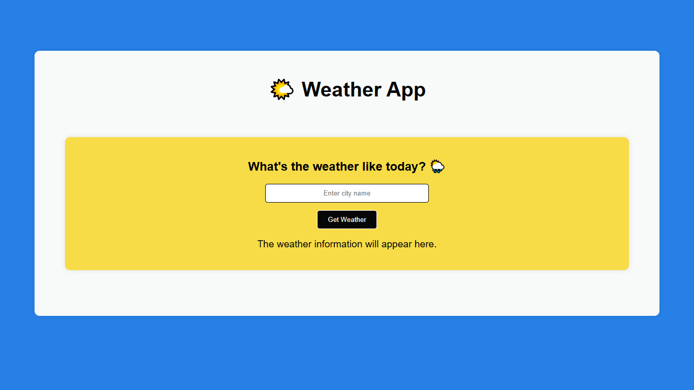

Weather App

A simple weather application built with HTML, CSS, and vanilla JavaScript that allows users to search for a city and view its current temperature.

Preview

Features
Search for a city by name
Automatically finds the city's location
Displays the current temperature
Shows loading and error messages
Uses real-time weather data
No external JavaScript libraries
Technologies
HTML
CSS
JavaScript
Fetch API
Open-Meteo API
How It Works
Enter a city name.
The app uses the Open-Meteo Geocoding API to find the city's latitude and longitude.
The coordinates are sent to the Open-Meteo Weather API.
The current temperature is displayed on the page.
Project Structure
weather-app/
├── index.html
├── style.css
├── script.js
├── weather-app.png
└── README.md

Getting Started

Clone the repository:

git clone https://github.com/your-username/weather-app.git

Open index.html in your browser and enter a city to check its current temperature.

API

This project uses the Open-Meteo API
 for geocoding and weather data.

## Preview

License

This project is open source and available under the MIT License.
